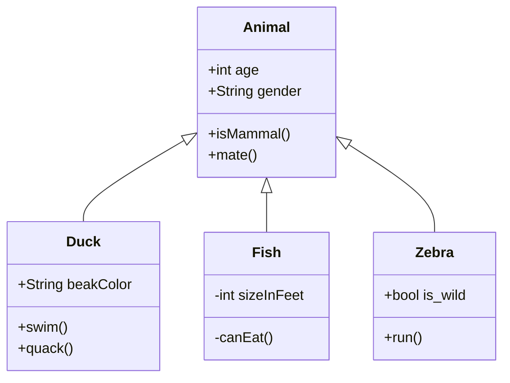

# Commit messages

Based on [conventionalcommits.org](https://www.conventionalcommits.org/en/v1.0.0/) and [developers.google.com](https://developers.google.com/blockly/guides/modify/contribute/commits).

<br>

**Structure –**

```plain
<type>[optional scope]: <description>

[optional body]

[optional footer]
```

<br>

**Types –**

|          |                          |                                                                                                             |
| -------- | ------------------------ | ----------------------------------------------------------------------------------------------------------- |
| feat     | Features                 | A new feature                                                                                               |
| fix      | Bug Fixes                | A bug fix                                                                                                   |
| docs     | Documentation            | Documentation only changes                                                                                  |
| style    | Styles                   | Changes that do not affect the meaning of the code (white-space, formatting, missing semi-colons, etc)      |
| refactor | Code Refactoring         | A code change that neither fixes a bug nor adds a feature                                                   |
| perf     | Performance Improvements | A code change that improves performance                                                                     |
| test     | Tests                    | Adding missing tests or correcting existing tests                                                           |
| build    | Builds                   | Changes that affect the build system or external dependencies (example scopes: gulp, broccoli, npm)         |
| ci       | Continuous Integrations  | Changes to our CI configuration files and scripts (example scopes: Travis, Circle, BrowserStack, SauceLabs) |
| chore    | Chores                   | Other changes that don't modify src or test files                                                           |
| revert   | Reverts                  | Reverts a previous commit                                                                                   |

<br>

**Breaking changes –**

Commits that make breaking changes should append a ! after the type of the commit. Breaking changes are changes that may break developers using Blockly in their apps, causing them to have to do extra work. For example:

```plain
fix!: return type of workspace.paste
```

> Breaking changes could have any of the above valid types.

<br>

**Description –**

The description must be non-empty, and must be under 256 characters.

<br>

**Body –**

The body is optional. If it is provided there should be a blank line between it and the description. It must be broken into lines of no more than 256 characters.

> Note that usually, it is advisable to put this kind of information in your pull request description, in addition to/rather than directly in the commit.

<br>

**Footer –**

The footer is optional. If it is provided there should be a blank line between it and the body. It must be broken into lines of no more than 256 characters.

---

---

# Markdown

**Editor –**

[Typora](https://typora.io/)

<br>

**Markdown Charts –**

[Mermaid](https://mermaid-js.github.io/mermaid/#/README?id=diagram-types) ([Sandbox](https://mermaid-js.github.io/mermaid-live-editor/edit))


`
````md

````

---

---

# Coding Patterns

**Monads –**

[](https://www.youtube.com/watch?v=C2w45qRc3aU)
[](https://www.youtube.com/watch?v=VgA4wCaxp-Q)

**Category Theory –**

[](https://www.youtube.com/watch?v=yAi3XWCBkDo)
